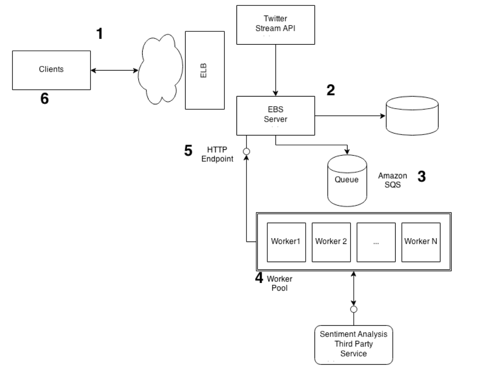

# Tweet-Sentiment
Sentiment and location visualization of Twitter data

## Overview
This web application displays a sentiment and location visualization of tweets related to the topic "Obama". The user can see either the geo-tagged tweets on a Google Maps view or a sentiment visualization through a heatmap that displays positive tweets with higher intensity. The view selection is possible through a dropdown menu in the app.

The application uses Amazon AWS to perform several tasks and has been developed mainly as a demo for various services of Amazon AWS for the class COMS 6998 - Cloud Computing and Big Data taught at Columbia University in the Fall 2014.

The application uses the following AWS services:
- Elastic Beanstalk (EBS)
- Elastic Load Balancing (ELB)
- EC2
- SQS
- SNS
- RDS Database

The architecture of the application on the server is displayed below:

## Application Deployment
The application is deployed very efficiently using AWS Elastic Beanstalk. Through this service, EC2 Web-Server instances can be easily set up and created automatically. The web-application is easily deployed and updated again through Elastic Beanstalk. Also, the load balancing option is selected so that load balancing can be managed automatically by AWS.

## Client-Side
The client-side code is served to the user when he accesses the URL of the app and is composed of the following files:
- index.html (landing page)
- googlemaps.js (logic of front-end)
- styles.css and appstyle.css (stylesheets of the app)

## Server-Side
The rest of the code belongs on the Server-Side. On the server the following tasks are performed:

### Fetch and Storage of Tweets
The EBS Server fetches tweets related to the topic "Obama" from the Twitter Live API and saves them in an RDS Database hosted by AWS along with their tweet ID and the time they were posted.

### Placement of tweets to an SQS queue
When the EBS Server gets each tweet, it enqueues it on an SQS queue for further processing. This allows the processing of the tweets to be able to scale by assigning it to a seperate worker pool and offloading it from the EBS Server.

### Tweets processing by a Worker pool
Elastic Beanstalk is used again to create a seperate Worker Instance Pool that dequeue the tweets from the SQS queue and talk to [Alchemy API](http://www.alchemyapi.com/) to get a sentiment analysis (positive or negative) from them.

### Notification to the EBS Server
Finally SNS is utilized to create a topic where the worker instances can send messages to regarding the sentiment analysis results. The EBS Server subscribes to this topic and gets notified about the sentiment of each tweet (using the tweet id) each time a worker posts about it to the topic.

### Tweets sentiment storage
Finally each tweet along with the sentiment is saved to the database. In this way the client car request the tweets along with their sentiment from the EBS server periodically and displays them in the UI.
